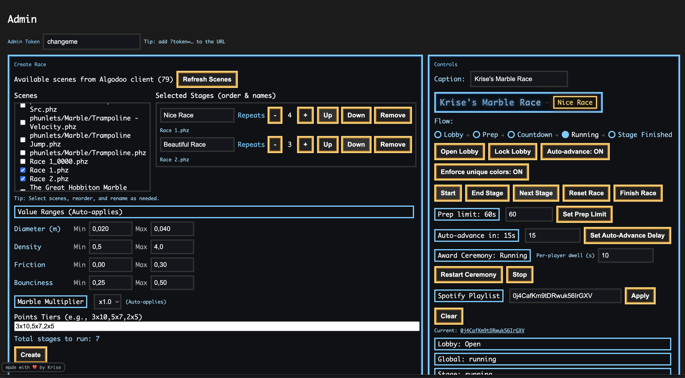
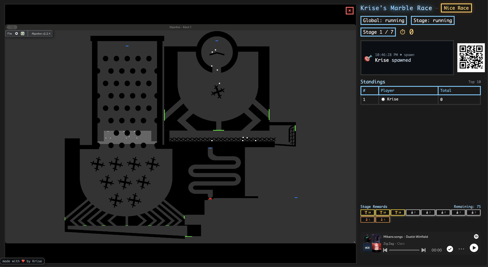
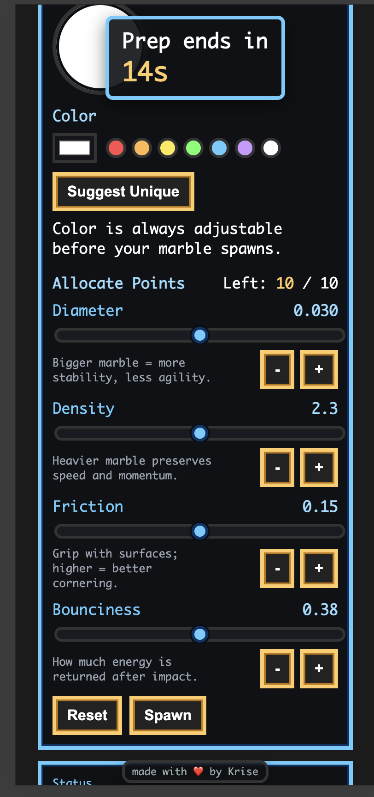

# Algodoo Node.js Connector

This monorepo contains a pluggable WebSocket server and related tools to
communicate with an Algodoo instance.

## Packages

- **algodoo-server** – WebSocket server that accepts plugins.
- **algodoo-cmd-dispatcher** – plugin providing a command queue between UI and
  Algodoo.
- **algodoo-client** – file based bridge to an Algodoo host.
- **algodoo-runtime** – small runtime library for browsers or Node.js
  environments.

## Docs

- Documentation home: [docs/README.md](./docs/README.md)
- Marble Race quick start: [docs/marblerace/quick-start.md](./docs/marblerace/quick-start.md)
- Marble Race advanced setup: [docs/marblerace/advanced-setup.md](./docs/marblerace/advanced-setup.md)
- Algodoo client bridge: [docs/algodoo-client.md](./docs/algodoo-client.md)

## Apps

- **Marble Race** – Full Algodoo + Colyseus game with web UIs.
  - Run: `pnpm run marblerace` (builds all then starts on `http://localhost:8080`).
  - Docs: see [docs/marblerace/README.md](./docs/marblerace/README.md)
  - Remember to run the file bridge: from the directory with `input.txt`/`ack.txt`/`output.txt` (or via envs), run `node packages/algodoo-client/dist/index.js`.

### Marble Race — Screenshots

<p>
  
  
</p>

<p>
  
</p>

## Building and Testing

```
pnpm install
pnpm build
pnpm test
```

Each package emits CommonJS, ES modules and TypeScript declarations in its
`dist` folder.

## Running the server

Build the packages and start the server with the command dispatcher plugin:

```
pnpm build
# Recommended: run the example app that wires the plugin programmatically
pnpm --filter algodoo-example start

# Alternatively: start the server binary and pass the plugin by file path
# node packages/algodoo-server/dist/index.js "$(pwd)/packages/algodoo-cmd-dispatcher/dist/index.js"
```

The plugin registers a HTTP path and serves a small React UI at
`http://localhost:8080/cmd`.

For the Marble Race app (recommended demo), use the dedicated starter:

```
pnpm -r build
pnpm run marblerace
# UIs:
#   http://localhost:8080/admin
#   http://localhost:8080/game
#   http://localhost:8080/dashboard
```

Programmatic usage:

```ts
import { startServer } from 'algodoo-server';
import cmdDispatcherPlugin from 'algodoo-cmd-dispatcher';

startServer({ plugins: [cmdDispatcherPlugin] });
```

## Connecting a UI

Use `algodoo-runtime` to connect to the server:

```ts
import { connect } from 'algodoo-runtime';

const runtime = connect('ws://localhost:8080', {
  onAccepted: (seq) => console.log('accepted', seq),
});

runtime.submitEval('print("hi")');
```

## Connecting Algodoo

Run the file bridge to communicate with a local Algodoo instance:

```
node packages/algodoo-client/dist/index.js
```

It writes commands to `input.txt`, reads acknowledgements from `ack.txt`, and
relays Algodoo events from `output.txt` back to the server/UI. The client is a
single self-contained Node bundle — you can copy `packages/algodoo-client/dist/index.js`
next to the Algodoo files and run it without installing node_modules.

Environment variables:

- `SERVER_URL` (default `ws://localhost:8080`)
- `INPUT` (default `./input.txt`)
- `ACK` (default `./ack.txt`)
- `OUTPUT` (default `./output.txt`)
- `POLL_MS` (default `250`)
- `LOG_LEVEL` (`info` or `debug`)

Atomic file writes:

- All file operations use a temp-file-and-rename strategy to avoid partial or
  conflicting reads: write `*.tmp`, then `rename` to the target path.

Reset on connect:

- On WebSocket connect, the client performs a RESET handshake to start from a
  clean state:
  1. Compute `resetSeq = lastAck + 1` (or `0` if none).
  2. Write a fresh `input.txt` containing ONLY one line: `"<resetSeq> RESET"`.
  3. Replace `output.txt` with an empty file.
  4. Wait until `ack.txt` contains `resetSeq`.
  5. When acknowledged, atomically clear `ack.txt` and `output.txt`, reset
     internal counters, then resume normal operation.

Command flow (input.txt):

- The server’s cmd-dispatcher assigns sequential IDs to submitted commands and
  enqueues them to the client. The client appends lines to `input.txt` in the
  format: `"SEQ CMD PARAMS"` (with newline), ensuring atomic writes.
- The client monitors `ack.txt`; when it sees a higher sequence number, it logs
  `ack: N` and removes acknowledged lines from future writes.

Output flow (output.txt → UI):

- Algodoo writes events into `output.txt` with one line per event:
  `"SEQ CMD [param1, param2, ...]"`. The parameter list supports numbers,
  booleans, and unquoted strings (e.g. `[1, true, IAmAString]`).
- The client tails `output.txt`, parses new lines, and sends them to the server
  as `{ type: 'output', payload: { seq, cmd, params } }`.
- The cmd-dispatcher plugin broadcasts these to all connected UIs; the bundled
  UI at `/cmd/` shows a live list of received outputs.

Logging:

- Client logs minimal high-signal events: `reset-start`, `ack: N`,
  `command-received {seq}`, and `output-received {seq, cmd}`. Set
  `LOG_LEVEL=debug` for detailed ticks and file operations.
-

## Plugin API

Plugins implement the `ServerPlugin` interface exported by `algodoo-server`:

```ts
interface ServerPlugin {
  name: string;
  path?: string;
  handleHttp?(req: IncomingMessage, res: ServerResponse, ctx: PluginContext): void;
  init?(ctx: PluginContext): void;
  onConnection?(ws: WebSocket, ctx: PluginContext): void;
  onMessage?(ws: WebSocket, msg: ClientMessage, ctx: PluginContext): void;
  onClose?(ws: WebSocket, ctx: PluginContext): void;
}
```

`PluginContext` provides access to the WebSocket server, all connected clients
and helper methods `broadcast` and `send`.
